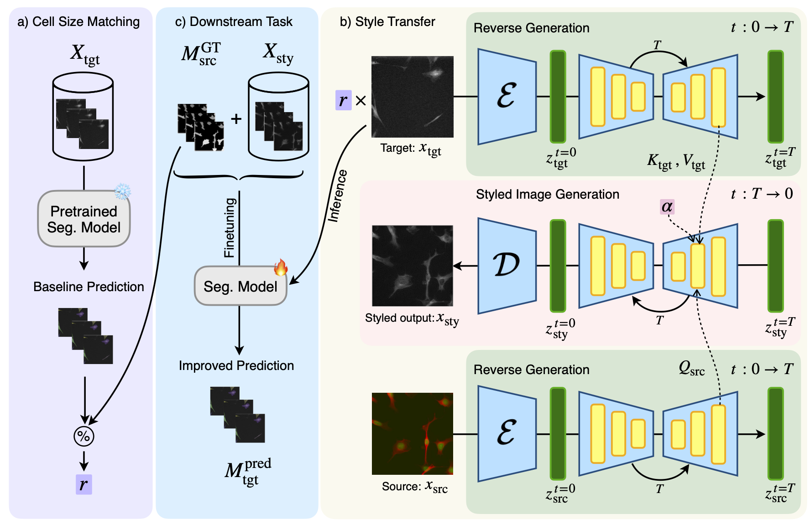

<h1 align="center">
    <strong>Library for CellStyle (MICCAI 2025)</strong>
</h1>

CellStyle is a deep learning framework for **cell image style transfer** built on top of [Stable Diffusion](https://github.com/CompVis/stable-diffusion). It allows you to blend structural information from a source dataset with visual style features from a target dataset, generating annotated datasets coupled with source labels without the need for training.

<p align="center">
    
</p>

<p align="center">
    <a href="https://arxiv.org/pdf/2503.08603">
        
    </a>
</p>

## 📦 Installation

We recommend using **conda** to manage dependencies.

```bash
# Clone this repository
git clone https://github.com/ruveydayilmaz0/cellStyle.git
cd cellStyle

# Create environment
conda env create -f environment.yml
conda activate cellstyle
```
---

## ⚙️ Usage

### 0. Download the Datasets
* [CTC](https://celltrackingchallenge.net/2d-datasets/)
* [Cell Image Library](https://www.cellimagelibrary.org/home)
* [Livecell](https://sartorius-research.github.io/LIVECell/)
* [NuInsSeg](https://www.kaggle.com/datasets/ipateam/nuinsseg)

### 1. Prepare configurations

All experiment settings are stored in a config file (e.g. `configs/config.sh`). Update paths inside the file to point to your datasets and model checkpoints.

### 2. Run the pipeline
Predict the adaptive score scaling ratio α:
```bash
python dynamicTemp.py --config configs/config.sh
```

Then, start the data generation:
```bash
python cellStyle.py --config configs/config.sh
```

### 3. Outputs

* Generated images are stored under the configured `output_path`.
* A `filenames.txt` log file is created to keep track of content, style, and output mappings.


### 4. Downstream Task
We use the generated data for finetuning generalist cell segmentation models:
* [Cellpose](https://github.com/MouseLand/cellpose)
* [StarDist](https://github.com/stardist/stardist)
* [Mediar](https://github.com/Lee-Gihun/MEDIAR)

## 🙏 Acknowledgements

* [StyleID](https://github.com/jiwoogit/StyleID) for the initial implementation.
* [Stable Diffusion](https://github.com/CompVis/stable-diffusion) for the generative backbone.

## Citation
If you make use of our repository, you can cite it as follows:
````bash
@article{yilmaz2025cellstyle,
  title={CellStyle: Improved Zero-Shot Cell Segmentation via Style Transfer},
  author={Yilmaz, R{\"u}veyda and Chen, Zhu and Wu, Yuli and Stegmaier, Johannes},
  journal={arXiv preprint arXiv:2503.08603},
  year={2025}
}
